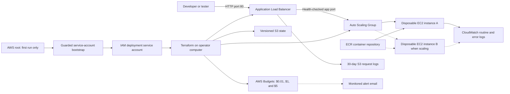

# Architecture, in plain language

## The one-sentence version

An AWS load balancer receives an HTTP request, chooses a healthy replaceable EC2
instance, and forwards the request to one Docker container; Terraform owns every
supporting network, identity, log, and registry resource.

A solid arrow is always used by the default one-instance workspace. A dotted
arrow represents the second instance that may appear when CPU-based scaling
requires it.

## Why these pieces exist

### VPC and subnets

The VPC is a private network boundary dedicated to one environment. Two public
subnets are placed in different Availability Zones because an Application Load
Balancer requires at least two. An Internet Gateway supplies internet routing.

The EC2 instances have public IPv4 addresses only for outbound operating-system
updates, AWS management APIs, and registry pulls. Their security group has no
public inbound rule, so knowing an instance's IP does not provide an entrance.
This arrangement saves the roughly US$0.045/hour base cost of a NAT Gateway,
but each public IPv4 address is itself billed. A production design would usually
move instances into private subnets and deliberately budget for NAT or VPC
endpoints.

### Load balancer

The ALB provides a stable DNS name while instances come and go. It accepts only
port 80 from the CIDR ranges in `allowed_ipv4_cidrs`. It forwards only to the
configured container port and stops forwarding to an unhealthy target.

HTTP is not encrypted. This is acceptable only for a stub that carries no
credentials, personal data, or private business data. A real domain, an AWS
Certificate Manager certificate, an HTTPS listener, and an HTTP-to-HTTPS redirect
must be added before sensitive use.

### Auto Scaling and launch template

The launch template is a complete recipe for a fresh instance: current Amazon
Linux 2023 image, encrypted gp3 root disk, instance role, IMDSv2, network group,
and bootstrap instructions. The Auto Scaling Group keeps the desired number
alive. It replaces failed instances and performs rolling replacement when the
container image digest or recipe changes.

The default count is one, with a maximum of two. A target-tracking policy asks
AWS to maintain about 60% average CPU utilization. The maximum is a cost boundary,
not merely a performance setting.

### Application container and ECR

The first apply runs a public nginx image as a smoke test. `publish_app.sh`
builds any inspected Docker project, pushes it to the environment's private ECR
repository, resolves the tag to an immutable digest, and records that digest in
an ignored Terraform variable file. Terraform then rolls the instances to that
exact image.

Do not place configuration secrets in a Docker image, Docker build argument,
Terraform variable, tag, or user-data script. A later application-specific module
should fetch secrets at runtime from Secrets Manager or Systems Manager Parameter
Store under a narrowly scoped instance policy.

### Identity and access

In the standalone first-run workflow, temporary AWS account-root browser
credentials create a dedicated IAM deployment service account. A local ignored
marker selects that service account's AWS CLI profile for future commands. Every
normal AWS-facing helper checks STS and refuses root unless the operator adds a
non-persistent `--run-as-root` exception. The helper does not change the
macOS/Linux login; “root” refers only to AWS identity.

The requested service account uses a long-term key, which AWS recommends
replacing with temporary role or IAM Identity Center credentials where
practical. It can manage the infrastructure action families but cannot create
IAM users or access keys directly. Its role-policy and pass-role combination is
privilege-escalation-capable. The generated policy is broad because a reusable
kit cannot know future account IDs and resource names; organizations should add
a permission boundary and narrow it with role, ARN, and tag conditions.

The service-account or approved human/CI role runs Terraform. EC2 never receives
those credentials. Each instance assumes its own AWS IAM role with three
purposes only:

1. register with Systems Manager so SSH can stay closed;
2. pull the workspace's ECR image;
3. write the workspace's CloudWatch logs.

Instance Metadata Service version 2 is mandatory, and the hop limit is one.

### Logs

Container stdout/stderr goes to a 14-day CloudWatch group. Normal bootstrap
output also stays 14 days. A separate bootstrap error file is collected into a
90-day group. ALB request logs stay 30 days in a private encrypted S3 bucket.
The operator's local scripts retain successful transcripts for 14 days/20 files
and failures for 90 days/100 files. Self-destruct account inventories and
redacted deletion manifests use a separate 365-day/20-file local retention class.

Application teams must write useful errors to stderr without credentials,
tokens, authorization headers, cookies, or personal data. Infrastructure cannot
correct unsafe application logging.

### Cost alerts

Three account-wide monthly AWS Budgets monitor gross costs before credits or
refunds reduce the bill. Each sends both actual and forecast notifications to
the required `budget_alert_emails` addresses when spend exceeds approximately
$0.01, $1, or $5. The $0.01 threshold is a near-zero-spend warning, not a
service-by-service Free Tier meter. AWS's native Free Tier alerts remain a
separate Billing preference and should stay enabled.

Budgets are alarms, not circuit breakers. Billing data is delayed, forecasts may
need weeks of history, and resources continue running after an alert. An operator
must investigate and run the guarded destroy workflow when appropriate.

### Ownership-safe retirement

The ordinary Terraform destroy path removes runtime resources and keeps the
separate state bucket and first-run service identity for recovery. A distinct
self-destruct path first inventories the selected account/Region, proves the
backend name and ownership, rejects any create/update action in the saved plan,
and requires an account/project/environment-specific phrase. Optional state and
IAM cleanup happen only after Terraform state contains no managed runtime
objects; harmless read-only data records may remain. Broad inventory is never
used as authorization to delete unrelated assets.

## What "stateless" requires from the application

An instance may disappear at any moment. Therefore the application must:

- accept requests on the configured port;
- expose a fast unauthenticated health path returning HTTP 200-399;
- write diagnostic output to stdout/stderr;
- keep sessions in signed cookies or a separate managed store;
- put uploaded files in an external object store;
- put durable records in an external database;
- tolerate two versions briefly overlapping during a rolling refresh;
- shut down/retry cleanly when a connection is interrupted.

Nothing written to the EC2 root disk is durable.

## Explicitly outside this starter kit

This development stub does not create DNS, TLS, a database, backups of application
data, WAF rules, private networking, a VPN, CI/CD credentials, a production
multi-account topology, or compliance controls. Each requires application and
organization-specific decisions that should not be guessed by a generic module.
